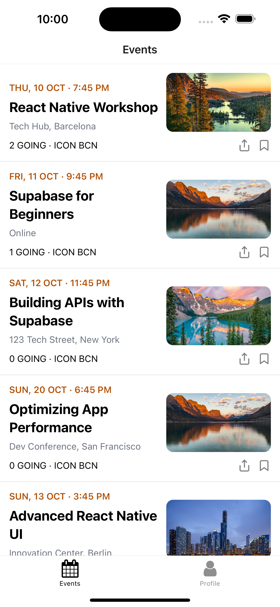

# Meetup Clone - Expo + React Native

This is a clone of the popular Meetup app built with Expo and React Native. It will showcases how to use Expo's routing system to create a tabbed navigation experience, and how to integrate Supabase for backend functionality. The project is created using create-expo-stack instead of create-expo-app as create-expo-stack provides upfront option to add batteries and options like routing, authentication, styling and more.

## Screenshots

**This is an ongoing project and will be updated as I go through the process of building this app.**